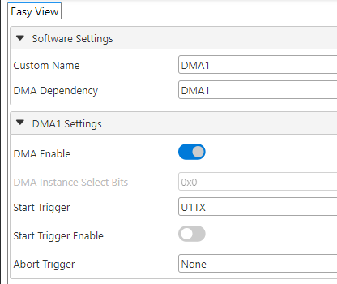
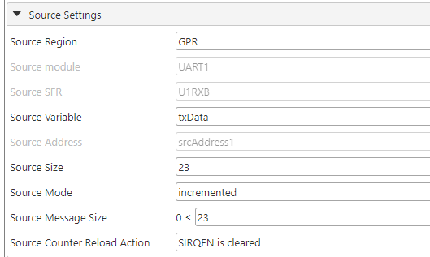
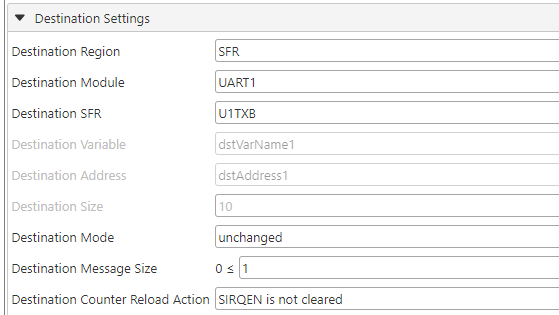
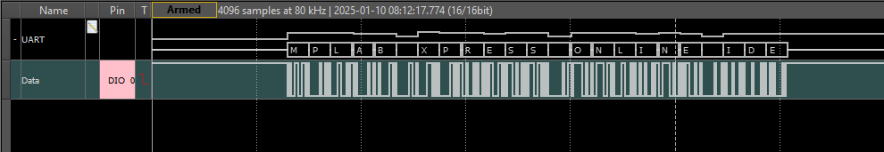

[](https://www.microchip.com)
# PIC18F27K42 DMA - RAM to UART TX Buffer - Hardware Triggered

# Introduction
The newer PIC18 family of devices showcase the Direct Memory Access (DMA) module. This module can be used to move data within the microcontroller without the CPU. This frees up the CPU to attend to other tasks.

The DMA module on the new PIC microcontrollers allows the user to read data from the Flash memory/EEPROM and the user RAM area and write it to the user RAM area. The DMA module has configurable source and destination addresses and programmable hardware triggers to start and abort the transaction.

On devices that feature the DMA module, the priority of the data buses is decided by a system arbiter. The priority level of each DMA is configurable, which allows flexibility for different types of applications. 

# Description
In this example, we will configure the DMA module to read data from an array stored in the RAM and write it in to the UART TX buffer. We will configure the hardware trigger for the DMA module to be the UART Transmit Interrupt, so the DMA will load the next data byte automatically. This hardware triggers allow the DMA module to wait until a byte of data is transmitted out of the TX buffer.

# MCC Settings
Here are the settings in Microchip Code Configurator (MCC) for the DMA module. Open MCC to modify these settings if needed.

### DMA Control Registers
These are settings for the DMA configuration registers. Look at the `dma.c` file to understand more about these selections.

<br>

### DMA Source Address and Size registers
These are the settings for the source size and address location. The source size is 23 bytes (0x0017).
<br>

### DMA Destination Address and Size registers
These are the settings for the destination size and address location. The destination size is 1 byte (0x0001), i.e. UART TX buffer.
<br>

### Other MCC Settings
MCC is used to set up the UART module as a transmitter and the I/O pins. Please open the project and MCC to look at these settings.

# Operation

The DMA trigger has been selected but not enabled. Note that enabling the trigger will initiate the DMA transfer immediately as the TX buffer is empty at start. Subsequent triggers are generated every time a byte has been sent out the TX buffer.

The following line of code in `main.c` will enable the trigger.

``` DMA1_TransferWithTriggerStart(); ```

# Results
The data from the UART module can be observed on pin RC6. It is to be observed that all this data is handled by the DMA module while the CPU is idling. This time can be used to perform other important tasks.

<br>
